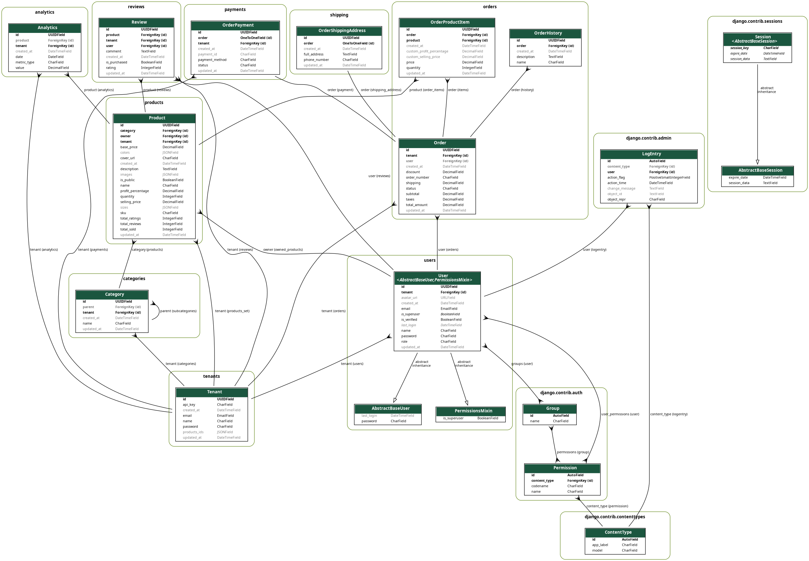

# ConnectX Backend

ConnectX is a Django-based backend application designed to manage users, products, orders, and transactions for an e-commerce platform.

## Table of Contents

- [Installation](#installation)
- [Usage](#usage)
- [Features](#features)
- [Contributing](#contributing)
- [License](#license)

## Installation

1. **Clone the repository:**
   ```bash
   git clone https://github.com/maajidAwol/ConnectX.git
   cd ConnectX/Backend
   ```

2. **Set up a virtual environment:**
   ```bash
   pipenv install
   ```

3. **Activate the virtual environment:**
   ```bash
   pipenv shell
   ```

4. **Install dependencies from Pipfile.lock:**
   ```bash
   pipenv install --ignore-pipfile
   ```

5. **Apply migrations:**
   ```bash
   python manage.py migrate
   ```

6. **Create a superuser (optional):**
   ```bash
   python manage.py createsuperuser
   ```

7. **Run the development server:**
   ```bash
   python manage.py runserver
   ```

8. **Run the tests:**
   ```bash
   python connectx_backend/manage.py test users products orders tenants categories payments shipping analytics reviews --noinput
   ```
9. **Remove the migration files:**
   ```bash
   find . -path "*/migrations/*.py" -not -name "__init__.py" -delete
   find . -path "*/migrations/*.pyc"  -delete
   ```
## Database Schema Visualization in Django

### 📌 Prerequisites
To visualize your Django models as a database schema diagram, you need to install `django-extensions` and `Graphviz`.

### 🛠 Installation
Run the following command to install the required dependencies:

```bash
pipenv install django-extensions graphviz
```

### 🔧 Configuration

#### 1️⃣ Enable `django-extensions`
Edit your **`settings.py`** file and add `django_extensions` to `INSTALLED_APPS`:

```python
INSTALLED_APPS = [
    ...
    'django_extensions',  # Enable Django Extensions
]
```

#### 2️⃣ Generate the Schema Diagram
Run the following command to generate a database schema diagram for **all apps**:

```bash
python manage.py graph_models -a -o schema.png
```

- `-a` → Generates a diagram for **all apps**.
- `-o schema.png` → Saves the output as `schema.png` in your project directory.

#### 3️⃣ View the Schema Diagram
Once the command runs successfully, open the `schema.png` file in your project directory to view the generated database schema.

### 🎯 Generate a Diagram for a Specific App
To generate a schema diagram for a **single app** (e.g., `reviews`), use:

```bash
python manage.py graph_models reviews -o reviews_schema.png
```

### 🚀 Additional Options
- To display **field types** in the diagram:

  ```bash
  python manage.py graph_models -a -g -o schema.png
  ```
  
  `-g` → Includes field types in the diagram.

- To show **relations only**:

  ```bash
  python manage.py graph_models -a -o schema.png --arrow-shape crow
  ```
## Database Schema

The generated database schema diagram is saved as `schema.png` in the project directory. Below is a preview of the schema:


## Usage

Once the server is running, you can access the API at `http://127.0.0.1:8000/`. You can use tools like Postman or cURL to interact with the API endpoints.

## Features

- User management with roles (Admin, Entrepreneur, Customer)
- Product management with categories
- Order processing and management
- Transaction logging for sales, restocks, and returns